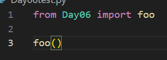
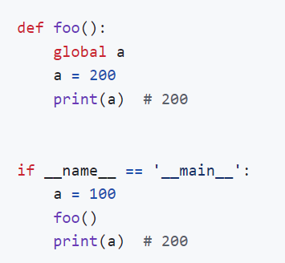
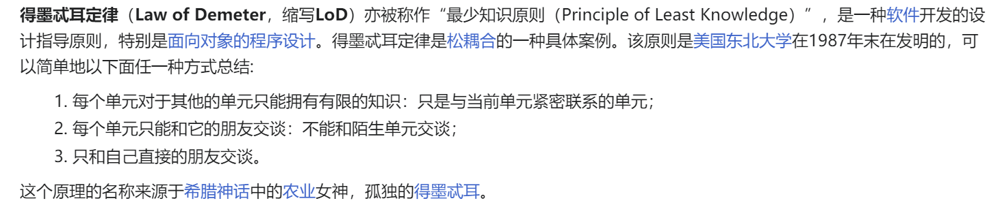
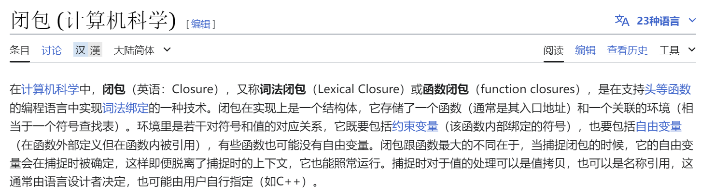
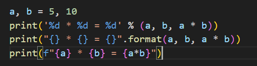

# 知识记录
## 06 函数的模块和使用

    

- python没有函数重载，后面的函数定义会覆盖前者

    

引用另一个文件的函数时，由于Day06.py文件被导入时会被执行一次，所以会导致Day06里面的一些不需要被执行的函数被执行，所以为了解决这个问题可以使用如下方法。

**if __name__ == "__main__":**
这行代码检查当前模块是否是主程序，如果是就会执行块内的代码，如果不是就不会执行快内的代码。

**辗转相除法**
1. 给定两个整数 α 和 b(其中 a > b)，计算 a 除以b的余数 r。
2. 将 a 赋值为 b，将 b赋值为 r。
3. 重复步骤1和步骤2，直到b等于0。此时，a的值就是a和b的最大公约数。

**求最小公倍数**
- X*Y//gcd(X,Y)

**切片**
- sequence[start:stop:step]

## 07字符串和常用数据结构
### 字符串
- 转义符号   r
- [:::]切片 左闭右开
- 索引
- len
- .capitalize 字符串首字母大写的拷贝
- .title 每个单词首字母大写的拷贝
- .upper
- .find   .index
- .center .rjust
- .isdigit  .isalpha  .isalnum
- .strip

### 列表
- 乘号*
- len
- for index in range(len(list))
- for elem in list
- for index, elem in enumerate(list)
- .append
- .insert
- .entend(list2)   += list2
- .remove
- .pop
- .clear
- 切片 [:]  [::-1]
- .sorted(list, reverse = , key = )  返回拷贝  .sort() 在原列表上操作
- [x for x in ...]     sys.getsizeof(list)
- yield    
eg:def fib(n): 
    a, b = 0, 1 
    for _ in range(n):
        a, b = b, a + b
        yield a
    def main():
        for val in fib(20):
            print(val)

### 元组

