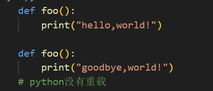

# 知识记录
## 06 函数的模块和使用

    

- python没有函数重载，后面的函数定义会覆盖前者

    

引用另一个文件的函数时，由于Day06.py文件被导入时会被执行一次，所以会导致Day06里面的一些不需要被执行的函数被执行，所以为了解决这个问题可以使用如下方法。

**if __name__ == "__main__":**
这行代码检查当前模块是否是主程序，如果是就会执行块内的代码，如果不是就不会执行快内的代码。

**辗转相除法**
1. 给定两个整数 α 和 b(其中 a > b)，计算 a 除以b的余数 r。
2. 将 a 赋值为 b，将 b赋值为 r。
3. 重复步骤1和步骤2，直到b等于0。此时，a的值就是a和b的最大公约数。

**求最小公倍数**
- X*Y//gcd(X,Y)